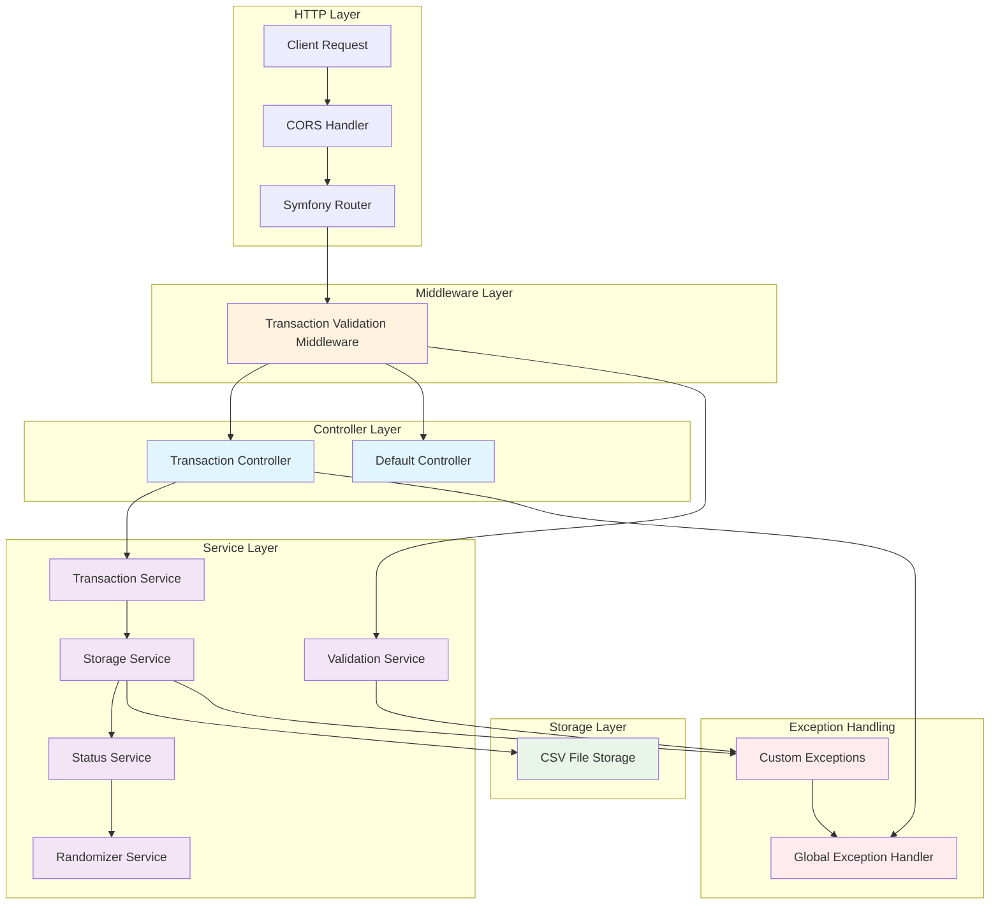

# Transaction Management System API - Technical Documentation

## Overview

The Transaction Management System API is a Symfony-based REST API designed for managing financial transactions. It provides a robust, scalable solution for creating, retrieving, and managing transaction data with automatic status assignment and CSV-based persistence.

The application is built using:
- [Symfony](https://symfony.com/) 7.3 - PHP web application framework
- [PHP](https://php.net/) 8.2+ - Server-side scripting language
- [Composer](https://getcomposer.org/) - Dependency management
- [PHPUnit](https://phpunit.de/) - Testing framework
- CSV file storage - Simple, portable data persistence

### Core Functionality

1. **Transaction Creation**
   - Accepts transaction data via POST requests
   - Validates input using middleware
   - Automatically assigns random status (Pending, Settled, Failed)
   - Persists data to CSV file

2. **Transaction Retrieval**
   - Returns all transactions via GET requests
   - Reads data from CSV file storage
   - Returns structured JSON responses

3. **Data Validation**
   - Comprehensive input validation
   - Custom validation rules for financial data
   - Detailed error reporting

4. **Error Handling**
   - Global exception handling
   - Custom exception classes
   - Standardized error responses

## Architecture

The application follows Symfony's best practices with a clear separation of concerns between controllers, services, middleware, and storage layers.

### Key Architectural Components

#### Controllers (`src/Controller/`)
Handle HTTP request/response cycle and coordinate with services:
- **TransactionController**: Manages transaction-related endpoints
- **DefaultController**: Handles CORS preflight requests

#### Services (`src/Services/`)
Encapsulate business logic and provide reusable functionality:
- **Transaction Services**: Core transaction management logic
- **Storage Services**: Data persistence operations
- **Validation Services**: Input validation logic
- **Status Services**: Transaction status management
- **Randomizer Services**: Random value generation

#### Middleware (`src/Middleware/`)
Process requests before they reach controllers:
- **TransactionValidationMiddleware**: Validates incoming transaction data

#### Exception Handling (`src/Exception/`, `src/ExceptionHandlers/`)
Custom error handling for different scenarios:
- **ValidationException**: Input validation errors
- **StorageException**: File system operation errors
- **ServiceException**: General service-level errors

## Application Architecture Diagram



## Project Structure

```text
Transaction-Management-System-API/
├── .env.example           # Environment variables template
├── .env                   # Environment configuration (not in VCS)
├── .gitignore            # Git ignore rules
├── README.md             # Project overview and quick start
├── composer.json         # PHP dependencies and project metadata
├── composer.lock         # Locked dependency versions
├── phpunit.dist.xml      # PHPUnit configuration
├── symfony.lock          # Symfony recipe lock file
├── bin/                  # Executable scripts
│   ├── console           # Symfony console commands
│   └── phpunit           # PHPUnit test runner
├── config/               # Application configuration
│   ├── bundles.php       # Bundle configuration
│   ├── preload.php       # PHP preloading configuration
│   ├── routes.yaml       # Route definitions
│   ├── services.yaml     # Service container configuration
│   ├── packages/         # Package-specific configuration
│   └── routes/           # Additional route files
├── data/                 # Data storage directory
│   └── transactions.csv  # CSV file containing transaction data
├── docs/                 # Documentation
│   └── README.md         # This technical documentation
├── public/               # Web-accessible directory
│   └── index.php         # Application entry point
├── src/                  # Application source code
│   ├── Kernel.php        # Application kernel
│   ├── Constants/        # Application constants
│   ├── Controller/       # HTTP request handlers
│   ├── Enum/             # PHP enumerations
│   ├── Exception/        # Custom exception classes
│   ├── ExceptionHandlers/ # Exception handling logic
│   ├── Middleware/       # Request processing middleware
│   └── Services/         # Business logic services
├── tests/                # Test suite
│   ├── bootstrap.php     # Test bootstrap file
│   └── Services/         # Service layer tests
├── var/                  # Variable files (cache, logs)
│   └── cache/            # Application cache
└── vendor/               # Composer dependencies
```

## Core Components

### Controllers

#### TransactionController (`src/Controller/TransactionController.php`)
Main controller handling transaction-related HTTP requests:

**Methods:**
- `getAll()`: Returns all transactions (GET /transactions)
- `create()`: Creates a new transaction (POST /transactions)

**Responsibilities:**
- Handle HTTP request/response cycle
- Coordinate with TransactionService
- Process validation results from middleware
- Return appropriate HTTP status codes and JSON responses

#### DefaultController (`src/Controller/DefaultController.php`)
Handles CORS preflight requests and provides API metadata:

**Methods:**
- `handleOptionsRequest()`: Handles OPTIONS requests for CORS support

### Services

#### Transaction Services (`src/Services/Transaction/`)

**TransactionService** - Main transaction business logic:
- Coordinates between controller and storage layer
- Implements TransactionServiceInterface
- Methods: `getAll()`, `create()`

**TransactionServiceInterface** - Contract for transaction services:
- Defines required methods for transaction operations
- Enables dependency injection and testing

#### Storage Services (`src/Services/Storage/`)

**TransactionStorageService** - CSV file storage implementation:
- Implements TransactionStorageInterface
- Handles file operations (read, write, create)
- Manages CSV file structure and headers
- Comprehensive error handling for file system operations

**Key Methods:**
- `readAll()`: Read all transactions from CSV
- `appendRow()`: Add new row to CSV file
- `createTransaction()`: Create and store new transaction

**TransactionStorageInterface** - Storage abstraction:
- Defines storage contract
- Enables switching storage implementations
- Methods: `readAll()`, `appendRow()`, `createTransaction()`

#### Status Services (`src/Services/Status/`)

**TransactionStatusService** - Manages transaction status assignment:
- Uses RandomizerService to select random status
- Returns TransactionStatus enum values
- Handles status-related business logic

#### Validation Services (`src/Services/Validation/`)

**TransactionValidator** - Input validation logic:
- Validates transaction data structure
- Applies business rules for transaction fields
- Returns detailed validation error messages

#### Randomizer Services (`src/Services/Randomizer/`)

**RandomizerService** - Random value generation:
- Provides random selection from arrays
- Used for status assignment
- Centralizes randomization logic

### Middleware

#### TransactionValidationMiddleware (`src/Middleware/TransactionValidationMiddleware.php`)
Symfony event subscriber that validates incoming requests:

**Functionality:**
- Subscribes to KernelEvents::REQUEST
- Validates POST requests to transaction endpoints
- Processes JSON request bodies
- Sets validation results as request attributes
- Handles ValidationException and stores violations

**Integration:**
- Uses TransactionValidator service
- Runs before controller execution
- Priority-based execution order

### Data Models

#### TransactionStatus Enum (`src/Enum/TransactionStatus.php`)
Defines possible transaction states:
- `Pending`: Transaction awaiting processing
- `Settled`: Successfully completed transaction
- `Failed`: Transaction that could not be completed

#### Transaction Data Structure
Based on CSV headers defined in StorageConstants:
```php
[
    'Transaction Date' => 'YYYY-MM-DD',
    'Account Number' => 'XXXX-XXXX-XXXX',
    'Account Holder Name' => 'String (2-100 chars)',
    'Amount' => 'Decimal number',
    'Status' => 'Pending|Settled|Failed'
]
```

## Data Handling

### CSV Storage Implementation

The application uses CSV files for data persistence, providing:
- **Simplicity**: No database setup required
- **Portability**: Easy data transfer and backup
- **Transparency**: Human-readable data format
- **Version Control**: Data changes can be tracked

#### Storage Process
1. **File Initialization**: Creates CSV file with headers if not exists
2. **Directory Management**: Creates data directory with proper permissions
3. **Data Reading**: Parses CSV into associative arrays
4. **Data Writing**: Appends new transactions as CSV rows
5. **Error Handling**: Comprehensive file system error management

#### File Structure
CSV file uses the following structure:
```csv
Transaction Date,Account Number,Account Holder Name,Amount,Status
2025-03-01,7289-3445-1121,Maria Johnson,150.00,Settled
2025-03-02,1122-3456-7890,John Smith,75.50,Pending
```

### Data Validation

#### Input Validation Rules
- **Transaction Date**: Required, valid date format (YYYY-MM-DD)
- **Account Number**: Required, format XXXX-XXXX-XXXX
- **Account Holder Name**: Required, 2-100 characters, letters and spaces only
- **Amount**: Required, positive decimal number

#### Validation Process
1. Middleware intercepts POST requests
2. JSON body is parsed and validated
3. Business rules are applied
4. Violations are collected and returned
5. Valid data is passed to controller

## Error Handling

### Exception Hierarchy

```text
Exception (PHP built-in)
├── ValidationException
├── StorageException
└── ServiceException
```

#### ValidationException (`src/Exception/ValidationException.php`)
Handles input validation errors:
- Contains array of violation messages
- Used by validation middleware
- Provides detailed field-level errors

#### StorageException (`src/Exception/StorageException.php`)
Handles file system and storage errors:
- File permission issues
- File not found errors
- Read/write operation failures

#### ServiceException (`src/Exception/ServiceException.php`)
General service-level errors:
- Business logic violations
- Service configuration issues
- Unexpected service failures

### Global Exception Handler (`src/ExceptionHandlers/GlobalExceptionHandler.php`)
Centralized exception handling:
- Catches unhandled exceptions
- Provides consistent error responses
- Logs errors for debugging
- Returns appropriate HTTP status codes

## Constants and Configuration

### Error Messages (`src/Constants/ErrorMessages.php`)
Centralized error message definitions:
- Validation error messages
- System error messages
- Status service errors
- Storage operation errors

### Storage Constants (`src/Constants/StorageConstants.php`)
CSV file configuration:
- Column headers definition
- File format specifications

### Middleware Constants (`src/Constants/MiddlewareConstants.php`)
Middleware configuration:
- Priority settings
- Execution order definitions

### Validation Constants (`src/Constants/ValidationConstants.php`)
Validation rule definitions:
- Field length limits
- Format patterns
- Business rule constraints

## API Reference

### Endpoints

#### GET /transactions
Retrieve all transactions from the system.

**Request:**
```http
GET /transactions HTTP/1.1
Host: localhost:8000
Accept: application/json
```

**Response (200 OK):**
```json
[
    {
        "Transaction Date": "2025-03-01",
        "Account Number": "7289-3445-1121",
        "Account Holder Name": "Maria Johnson",
        "Amount": "150.00",
        "Status": "Settled"
    }
]
```

**Response (500 Internal Server Error):**
```json
{
    "error": "Storage error",
    "message": "Failed to read CSV file"
}
```

#### POST /transactions
Create a new transaction with automatic status assignment.

**Request:**
```http
POST /transactions HTTP/1.1
Host: localhost:8000
Content-Type: application/json

{
    "transactionDate": "2025-03-15",
    "accountNumber": "1234-5678-9012",
    "accountHolderName": "John Doe",
    "amount": 250.75
}
```

**Response (201 Created):**
```http
HTTP/1.1 201 Created
Content-Type: application/json

null
```

**Response (400 Bad Request):**
```json
{
    "error": "Validation failed",
    "violations": [
        "Account number must be in format XXXX-XXXX-XXXX",
        "Amount must be a positive number"
    ]
}
```

#### OPTIONS /{request}
Handle CORS preflight requests for any endpoint.

**Request:**
```http
OPTIONS /transactions HTTP/1.1
Host: localhost:8000
Origin: https://frontend-domain.com
Access-Control-Request-Method: POST
Access-Control-Request-Headers: Content-Type
```

**Response:**
```http
HTTP/1.1 200 OK
Access-Control-Allow-Origin: *
Access-Control-Allow-Methods: GET, POST, PUT, DELETE, OPTIONS
Access-Control-Allow-Headers: Content-Type, Authorization
```

### Status Codes

- **200 OK**: Successful GET request
- **201 Created**: Successful POST request
- **400 Bad Request**: Validation errors
- **500 Internal Server Error**: Server-side errors

## Configuration and Environment

### Environment Variables

The application uses environment variables for configuration:

#### Required Variables
```env
# Application environment (dev, prod, test)
APP_ENV=dev

# Application secret key for security
APP_SECRET=your-secret-key-here
```

#### Optional Variables
```env
# Default route configuration
DEFAULT_URI=/

# CSV storage path (relative to project root)
CSV_STORAGE_PATH=data/transactions.csv
```

### Service Configuration (`config/services.yaml`)
Dependency injection configuration:
- Service definitions
- Parameter injection
- Interface bindings

Example service configuration:
```yaml
services:
    App\Services\Storage\TransactionStorageService:
        arguments:
            $csvPath: '%kernel.project_dir%/data/transactions.csv'
```

## Testing

### Test Structure
The test suite follows the same structure as the source code:

```text
tests/
├── bootstrap.php         # Test initialization
└── Services/            # Service layer tests
    ├── Random/          # Randomizer service tests
    ├── Status/          # Status service tests
    ├── Storage/         # Storage service tests
    ├── Transaction/     # Transaction service tests
    └── Validation/      # Validation service tests
```

#### Unit Tests
- Test individual service methods
- Mock dependencies
- Verify business logic
- Test error conditions

### Running Tests

```bash
# Run all tests
./vendor/bin/phpunit

# Run specific test suite
./vendor/bin/phpunit tests/Services/Transaction/

# Run with coverage report
./vendor/bin/phpunit --coverage-html coverage/

# Run tests in specific environment
APP_ENV=test ./vendor/bin/phpunit
```

### Test Configuration
PHPUnit configuration in `phpunit.dist.xml`:
- Test directories
- Code coverage settings
- Bootstrap file configuration
- Environment variables

## Development Guidelines

### Code Standards
- **PSR-12**: Coding style standard
- **Strict Typing**: All PHP files use strict typing
- **Type Declarations**: Method parameters and return types
- **Final Classes**: Use final keyword where appropriate

### Best Practices
- **Dependency Injection**: Use constructor injection
- **Interface Segregation**: Small, focused interfaces
- **Single Responsibility**: One purpose per class
- **Error Handling**: Comprehensive exception handling

### File Organization
- **Namespaces**: Follow PSR-4 autoloading
- **Class Names**: Descriptive and specific
- **Method Names**: Verb-based, action-oriented
- **Constants**: Grouped in dedicated classes

## Deployment

### Development Deployment
```bash
# Start development server
symfony serve

# Or using PHP built-in server
php -S localhost:8000 -t public/
```

### Production Deployment

#### Web Server Configuration
Configure your web server to:
- Point document root to `public/` directory
- Enable PHP processing
- Set proper file permissions
- Configure HTTPS

#### Apache Virtual Host Example:
```apache
<VirtualHost *:80>
    DocumentRoot /path/to/project/public
    ServerName your-domain.com
    
    <Directory /path/to/project/public>
        AllowOverride All
        Require all granted
    </Directory>
</VirtualHost>
```

#### File Permissions
```bash
# Set proper permissions
chmod -R 755 public/
chmod -R 775 var/
chmod -R 775 data/
```

### Environment Setup
1. Set `APP_ENV=prod` in production
2. Generate secure `APP_SECRET`
3. Configure CSV storage path
4. Enable OPcache for performance
5. Set up error logging

## Security Considerations

### Input Validation
- All input is validated before processing
- JSON parsing with error handling
- Sanitization of user data
- Protection against injection attacks

### File System Security
- Restricted file access permissions
- Protected data directory
- Secure file operations
- Error message sanitization

### CORS Configuration
- Configurable CORS headers
- Support for preflight requests
- Origin validation capabilities

### Error Information
- Production error messages are generic
- Detailed errors only in development
- Sensitive information is not exposed

This documentation provides a comprehensive technical overview of the Transaction Management System API, covering architecture, implementation details, and operational guidance for developers and system administrators.
